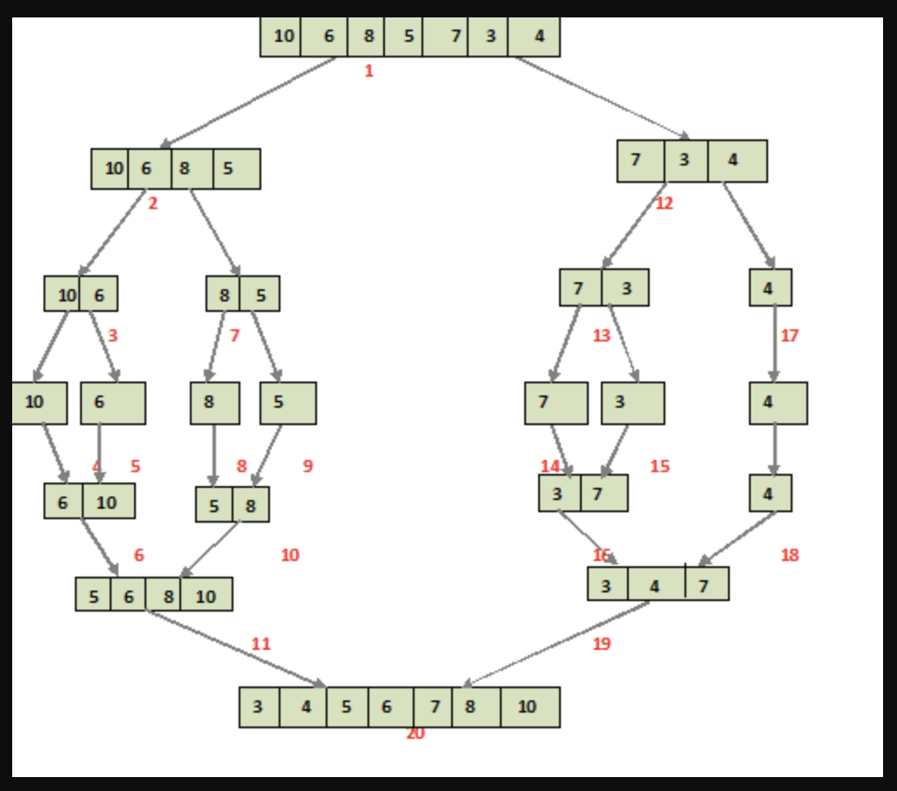

# Blog Notes: Merge Sort
Merge Sort is a divide and conquer algorithm, the problem set of ordering an array is divided into sub-problems
 and solved at a smaller scale and then successively solved at larger scale as the sub-problems are reintegrated into one another.
 This is accomplished by halving the array down into its smallest constituent elements, single items, then sorting recursively from there.
 This algorithm can be implemented through a recursive top-down method or a bottom-up iterative method. 

## Learning Objectives
* The primary focus of this blog post is to explore and explain the nuances of the merging method of sorting algorithms.
* Pros and cons of insertion sort 
* Visualization of the algorithm at work

## Information Flow
* Given its inherent time complexity, merge sort is one of the faster sorting algorithms available to us since so many sorts require at least quadratic time and very few are any better.
    * In worst/average/best cases it achieves O(n log n), this predictability makes it both easy to reason about and dependable.
* The space complexity of O(n) could be criticized as a weakness but that is fairly average for sorting and ultimately many space concerns are negligible.
    * Cloud storage makes previous concerns of making every KB count are not practical any longer, and while space shouldn't be wasted, that space will be returned to the system as soon as the sort concludes.
    
## Diagram
* 

## Algorithm
* Step 1 − if it is only one element in the list it is already sorted, return.
* Step 2 − divide the list recursively into two halves until it can no more be divided.
* Step 3 − merge the smaller lists into new list in sorted order.

## Pseudocode
```
 ALGORITHM Mergesort(arr)
    DECLARE n <-- arr.length
           
    if n > 1
      DECLARE mid <-- n/2
      DECLARE left <-- arr[0...mid]
      DECLARE right <-- arr[mid...n]
      // sort the left side
      Mergesort(left)
      // sort the right side
      Mergesort(right)
      // merge the sorted left and right sides together
      Merge(left, right, arr)

ALGORITHM Merge(left, right, arr)
    DECLARE i <-- 0
    DECLARE j <-- 0
    DECLARE k <-- 0

    while i < left.length && j < right.length
        if left[i] <= right[j]
            arr[k] <-- left[i]
            i <-- i + 1
        else
            arr[k] <-- right[j]
            j <-- j + 1
            
        k <-- k + 1

    if i = left.length
       set remaining entries in arr to remaining values in right
    else
       set remaining entries in arr to remaining values in left
```

## Readings and References

####  Watch
* [Gayle Laakmann McDowell Merge Sort Algorithm in Java Video](https://www.youtube.com/watch?v=KF2j-9iSf4Q)
* [Jonathon Kwisses Merge Sort Algorithm in Java Video](https://www.youtube.com/watch?v=yv6svAfoYik)

#### Read
* [Baeldung Merge Sort in Java Article](https://www.baeldung.com/java-merge-sort)
* [InterviewBit Merge Sort Article](https://www.interviewbit.com/tutorial/merge-sort-algorithm/)
* [TutorialsPoint Merge Sort Article](https://www.tutorialspoint.com/data_structures_algorithms/merge_sort_algorithm.htm)
* [HackerEarth Merge Sort Article](https://www.hackerearth.com/practice/algorithms/sorting/merge-sort/tutorial/)

#### Bookmark
* [Visualgo Merge Sort Site Link](https://visualgo.net/en/sorting?slide=10)


