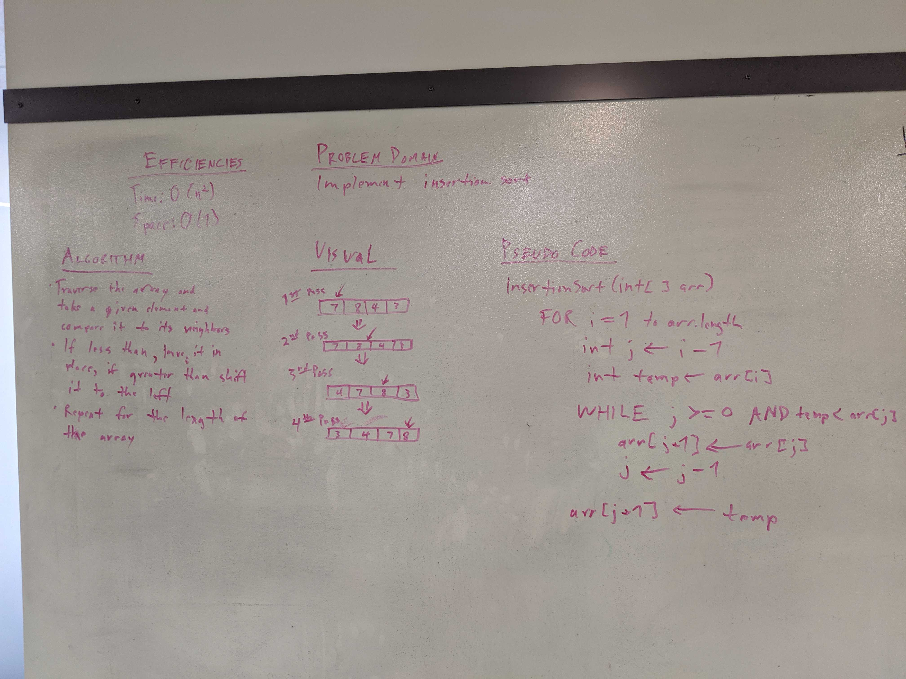

# Challenge Summary
INSERTION SORT

## Challenge Description
* Complete a working, tested implementation of Insertion Sort, based on the pseudo code provided
* Create a blog post on understanding the Insertion Sort Algorithm suitable for a 301 level student. Alternately, prepare a presentation that presents the algorithm in a novel way. E.g. a short skit, live mini-lecture, interpretive dance.

## Approach & Efficiency
* I utilized the imperative method prescribed in the pseudo code and achieved the following efficiencies.
    * Time Complexity: O(n^2)
    * Space Complexity: O(1)

## Solution
* 

## Collaborators
* N/A

