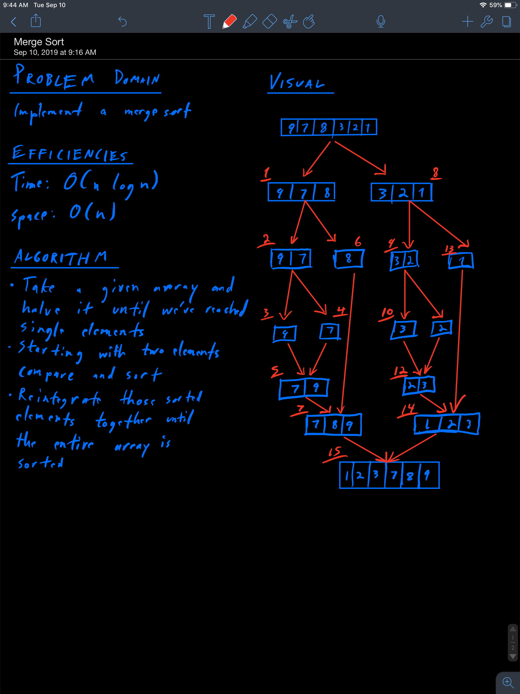

# Challenge Summary
MERGE SORT

## Challenge Description
* Complete a working, tested implementation of Merge Sort, based on the pseudo code provided
* Create a blog post on understanding the Merge Sort Algorithm suitable for a 301 level student. Alternately, prepare a presentation that presents the algorithm in a novel way. E.g. a short skit, live mini-lecture, interpretive dance.

## Approach & Efficiency
* I utilized the recursive method prescribed in the pseudo code and acheived the following efficiencies:
    * Time Complexity: O(n log n)
    * Space Complexity: O(n)

## Solution
* 

## Collaborators
* N/A

