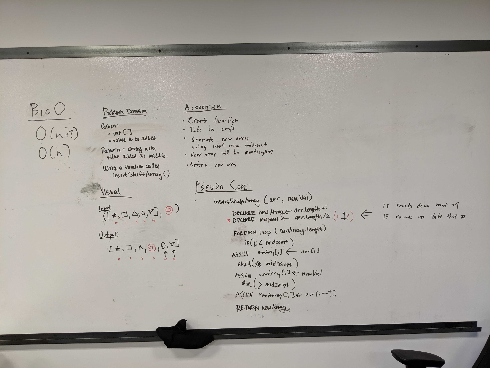

# Shift an Array
This is the second code challenge of Code Fellows 401 Java course.

## Challenge
Write a function called insertShiftArray which takes in an array and the value to be added. Without utilizing any of the built-in methods available to your language, return an array with the new value added at the middle index.

## Approach & Efficiency
My partner(Jane Hur) and I decided to build a new array and filling the elements of it using the values of the input array. We ascertained the midpoint and used that as a pivot with which to add values at the correct index.

The time complexity of this solution is O(n + 1) and the space complexity is O(n),

## Solution
