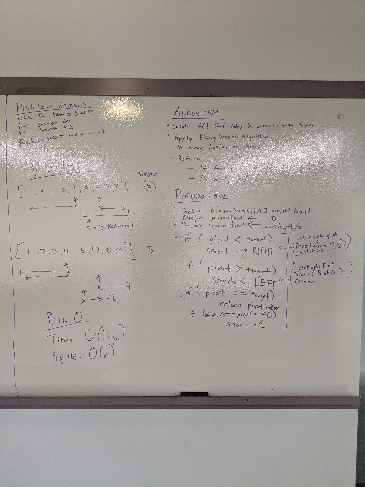

# Binary Search an Array
This is the third code challenge of Code Fellows 401 Java course.

## Challenge
Write a function called BinarySearch which takes in 2 parameters: a sorted array and the search key. Without utilizing any of the built-in methods available to your language, return the index of the array’s element that is equal to the search key, or -1 if the element does not exist.

## Approach & Efficiency
My partner(Steven Grant) and I utilized Binary Search to find the target value in the array.

The time complexity of this solution is O(log n) and the space complexity is O(1),

## Solution
