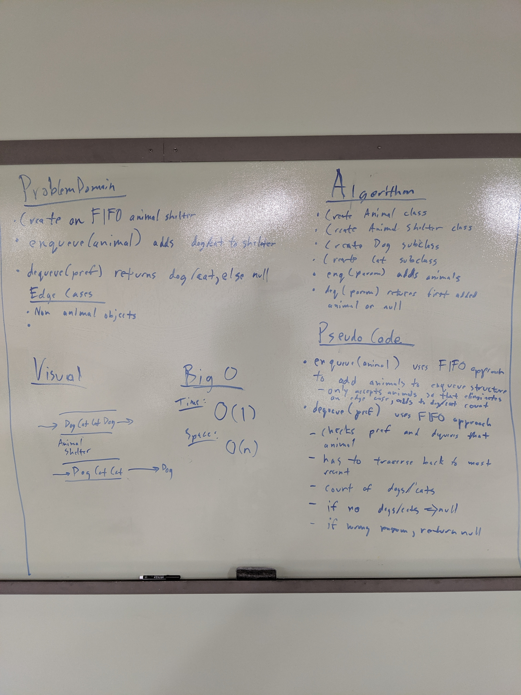

# Challenge Summary
* First-in, First out Animal Shelter.

## Challenge Description
*  Create a class called AnimalShelter which holds only dogs and cats. The shelter operates using a first-in, first-out approach.
*  Implement the following methods:
    * ```enqueue(animal)```: adds ```animal``` to the shelter. ```animal``` can be either a dog or a cat object.
    * ```dequeue(pref)```: returns either a dog or a cat. If ```pref``` is not ```"dog"``` or ```"cat"``` then return null.

## Approach & Efficiency
*  I utilized a two interior queue structure which allows me to maintain O(1) time complexity for either operation of enqueue() or dequeue() by performing the operations strictly on the interior dog and cat queues. 
*  Space complexity for either operation is going to be O(n)

## Solution
