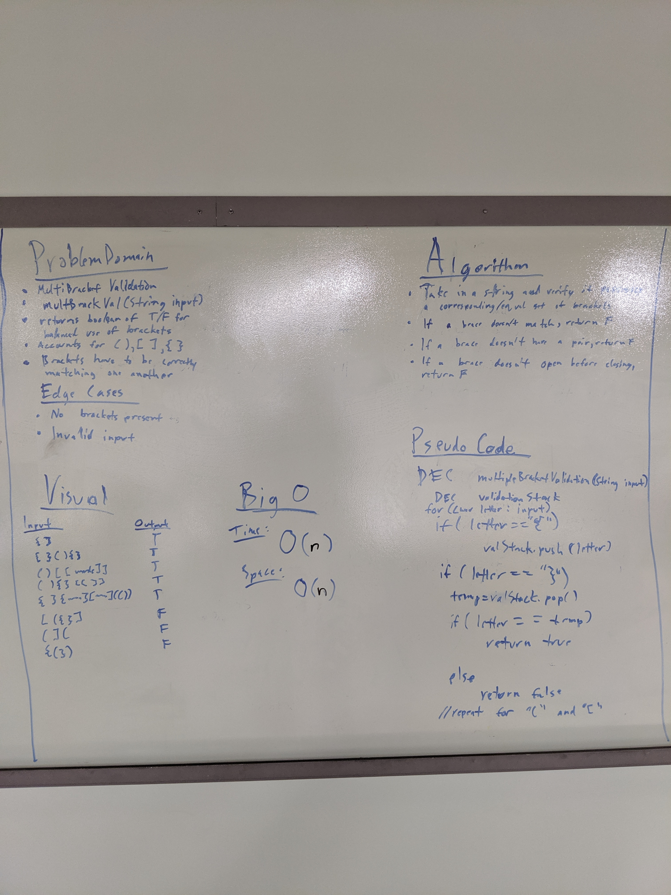

# Challenge Summary
* Multi-bracket Validation.

## Challenge Description
*  On your main file, create…
    * C#: a method called ```public static bool MultiBracketValidation(string input)```
    * JavaScript: a function called ```multiBracketValidation(input)```
    * Python: a function called ```multi_bracket_validation(input)```
    * Java: a method ```public static boolean multiBracketValidation(String input)```

Your function should take a string as its only argument, and should return a boolean representing whether or not the brackets in the string are balanced. There are 3 types of brackets:

* Round Brackets : ```()```
* Square Brackets : ```[]```
* Curly Brackets : ```{}```

## Approach & Efficiency
*  I combined a generic for loop and a stack to iterate over every character in a given string and parse whether the brackets included have matching counterparts or not. This is done by pushing opening brackets onto the stack and popping them every time the corresponding closing bracket is found. It will always be ```O(n)``` time complexity, with ```n``` being the length of the string input.
*  Space complexity for any operation is going to be ```O(n)```.

## Solution
