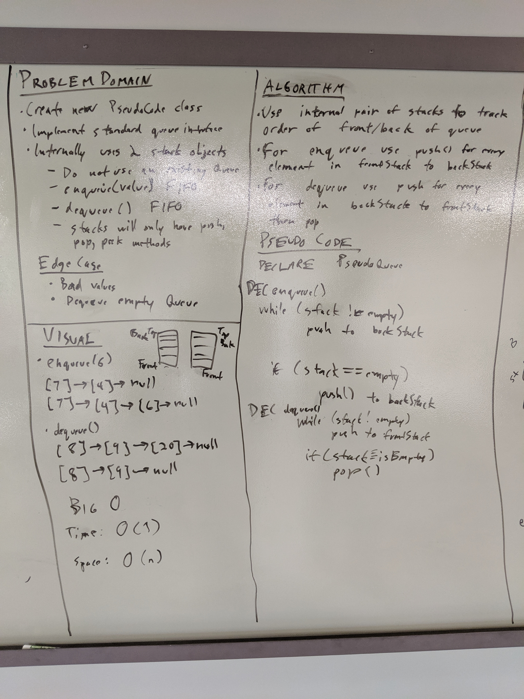

# Challenge Summary
* Implement a Queue using two Stacks.

## Challenge Description
Create a brand new PseudoQueue class. Do not use an existing Queue. Instead, this PseudoQueue class will implement our standard queue interface (the two methods listed below), but will internally only utilize 2 Stack objects. Ensure that you create your class with the following methods:

* enqueue(value) which inserts value into the PseudoQueue, using a first-in, first-out approach.
* dequeue() which extracts a value from the PseudoQueue, using a first-in, first-out approach.

The Stack instances have only push, pop, and peek methods. You should use your own Stack implementation. Instantiate these Stack objects in your PseudoQueue constructor.

## Approach & Efficiency
* For the enqueue() I pushed onto the back stack internal data structure every time it is called. This achieves an O(1) time and space complexity for the method.
* For the dequeue() I treateds the two internal stacks akin to balancing cups, the back stack empties into the front stack every time and then pops the top of that stack. The front queue then immediately returns all of the elements into the back stack. This achieves an O(n) time complexity and an O(1) space complexity for the method.

## Solution

