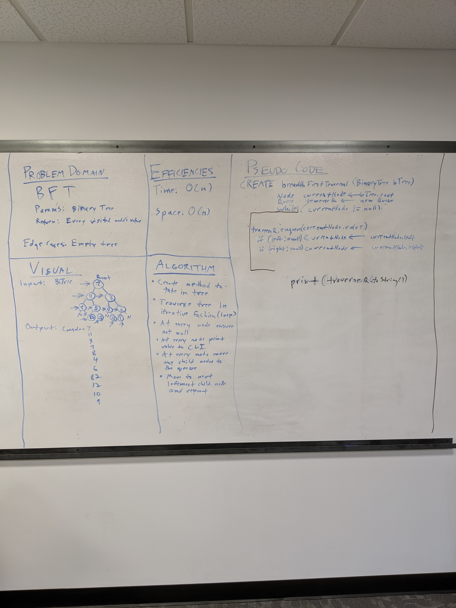

# Challenge Summary
Breadth-first Traversal.

## Challenge Description
* Write a breadth first traversal method which takes a Binary Tree as its unique input. Without utilizing any of the built-in methods available to your language, traverse the input tree using a Breadth-first approach; print every visited node’s value.

## Approach & Efficiency
* I combined a helper queue with an iterative approach to traverse every node in the tree and produce a System.out at a given node so long as it isn't null.
* Time: O(n)
* Space: O(n)

## Solution

