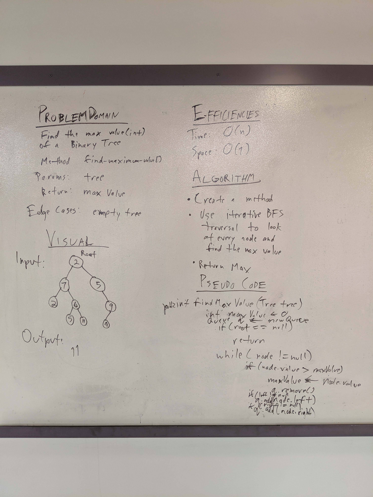

# Challenge Summary
Find the Maximum Value in a Binary Tree

## Challenge Description
* Write an instance method called ```find-maximum-value```. Without utilizing any of the built-in methods available to your language, return the maximum value stored in the tree. You can assume that the values stored in the Binary Tree will be numeric.

## Approach & Efficiency
* I went back to a recursive approach to solve this problem, I perform a comparison at every node I reach and track the results for current, left, and right and finally compare them against each other at the end.
* Time: O(n)
* Space: O(1)

## Solution

