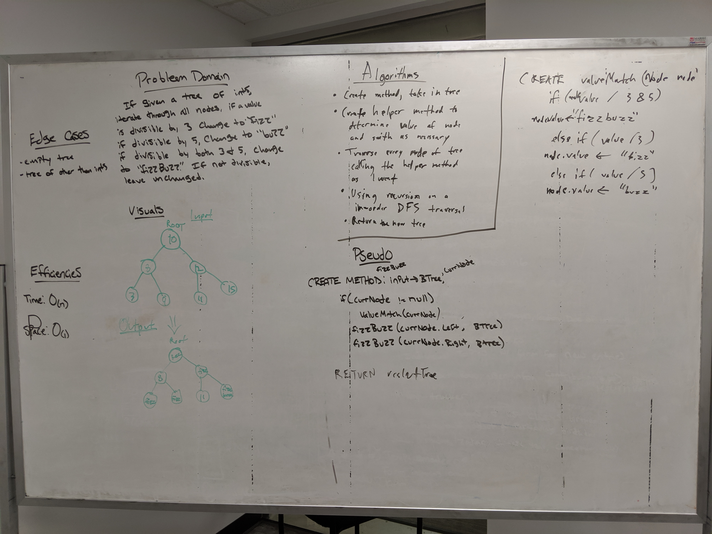

# Challenge Summary
Conduct “FizzBuzz” on a tree while traversing through it. Change the values of each of the nodes dependent on the current node’s value

## Challenge Description
* Write a function called ```FizzBuzzTree``` which takes a tree as an argument.
* Without utilizing any of the built-in methods available to your language, determine weather or not the value of each node is divisible by 3, 5 or both, and change the value of each of the nodes:
    * If the value is divisible by 3, replace the value with “Fizz”
    * If the value is divisible by 5, replace the value with “Buzz”
    * If the value is divisible by 3 and 5, replace the value with “FizzBuzz”
* Return the tree with its new values.

* For explicitly-typed languages: Ensure your node values are of type ```Object```, to hold either strings or integers.

## Approach & Efficiency
* I used a DFS recursive solution to traverse the tree, since it has to hit every node of the given tree it will always result in a linear time complexity. 
* Time complexity: O(n)
* Space comnplexity: O(1)

## Solution

